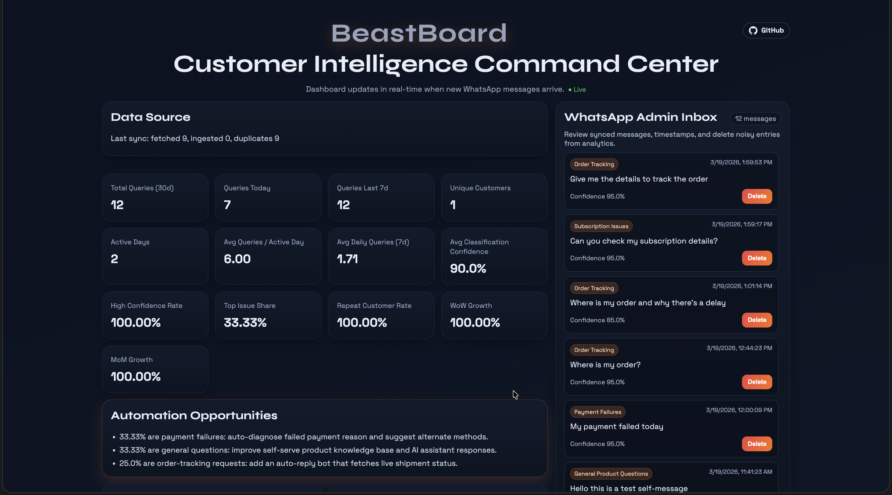
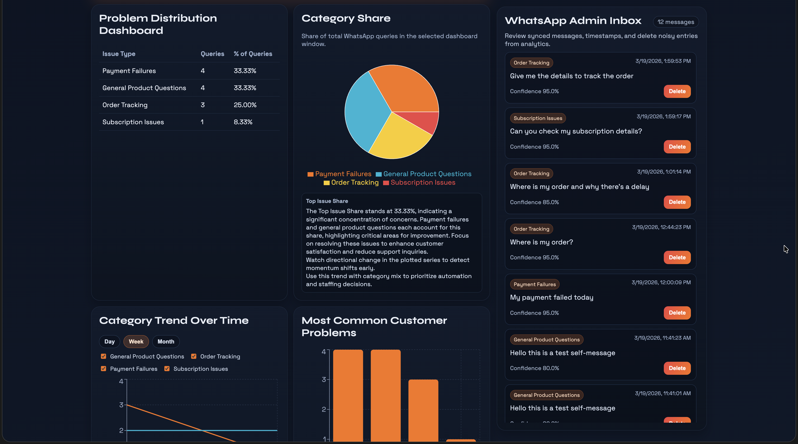
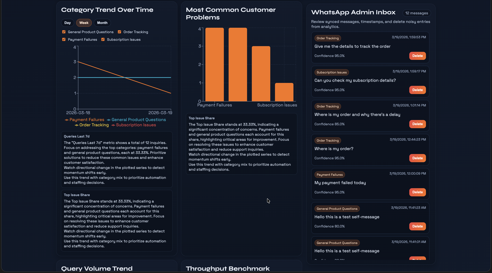
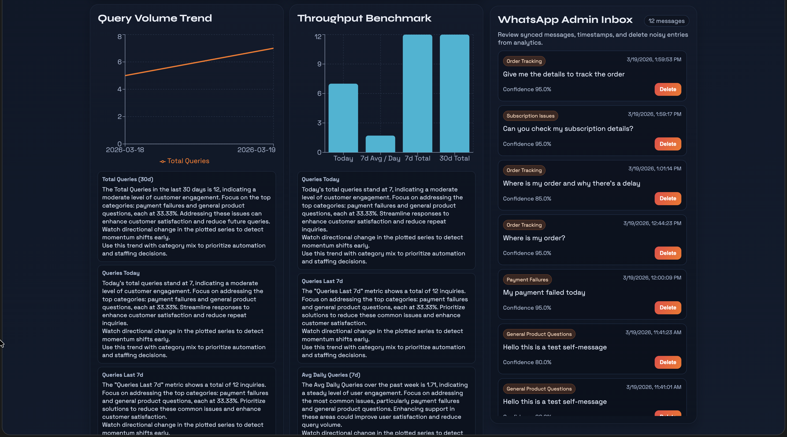
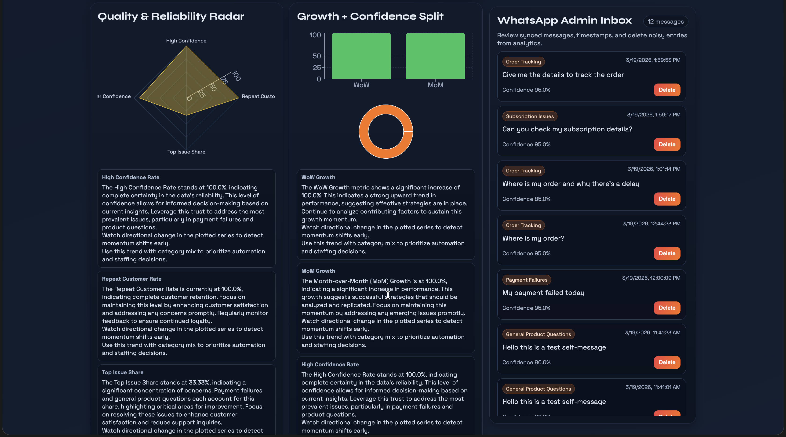

# BeastBoard

[](https://github.com/negativenagesh/BeastBoard)
[](https://github.com/negativenagesh/BeastBoard)


<p>
  
</p>

BeastBoard is an AI-powered support analytics dashboard. It ingests customer messages (primarily from WhatsApp self-chat sync), classifies each message into a support category, stores results in SQLite, and presents real-time operational insights in a React dashboard.

<p align="left">
  
</p>
<p align="left">
  
</p>
<p align="left">
  
</p>
<p align="left">
  
</p>
<p align="left">
  
</p>

## Setup

### 1) Clone the repository

```bash
git clone https://github.com/negativenagesh/BeastBoard
cd BeastBoard
```

### 2) Backend (uv)

```bash
uv init
uv venv
source .venv/bin/activate
uv sync
```

Create `.env` in project root:

```env
OPENAI_API_KEY=your_openai_api_key
OPENAI_MODEL=gpt-4o-mini
DATABASE_URL=sqlite:///./beastboard.db
CORS_ORIGINS=["http://localhost:5173"]
WHATSAPP_GATEWAY_URL=
WHATSAPP_GATEWAY_TOKEN=
DASHBOARD_DATA_CUTOFF_ISO=2026-03-18T00:00:00+00:00
```

UltraMsg credentials setup (for live WhatsApp sync):

1. Open your UltraMsg instance panel:
  - https://user.ultramsg.com/
2. Copy your instance API token from the instance settings/API section.
3. Set these values in `.env`:

```env
WHATSAPP_GATEWAY_URL=https://api.ultramsg.com/instance********
WHATSAPP_GATEWAY_TOKEN=your_ultramsg_api_token
```

4. Optional (recommended): in UltraMsg webhook settings, set your webhook URL to:
  - `http://localhost:8000/api/whatsapp/webhook`
  - For deployed environments, use your public backend URL instead of localhost.

Note: use the instance base URL only (for example `https://api.ultramsg.com/instance166098`). Do not append endpoint paths like `/messages/chat`.

Run backend:

```bash
uv run main.py
```

Backend URL: `http://localhost:8000`

### 3) Frontend

```bash
cd frontend
npm install
npm run dev
```

Frontend URL: `http://localhost:5173`

Optional frontend env:

```env
VITE_API_URL=http://localhost:8000
```

## What This Project Does

- Ingests incoming messages from WhatsApp webhook and UltraMsg self-message sync.
- Classifies each message into one issue category using OpenAI (or keyword fallback if API key is missing).
- Stores message text, category, confidence, and suggested action.
- Computes dashboard metrics and category distribution for recent periods.
- Generates automation recommendations from dominant issue categories.
- Streams dashboard update events via SSE when new messages are ingested.

## Supported Categories

- `order_tracking`
- `delivery_delays`
- `refund_requests`
- `product_complaints`
- `subscription_issues`
- `payment_failures`
- `general_product_questions`

## Dashboard

Dashboard includes:

- KPI cards for support operations.
- Issue distribution table and category share chart.
- Multi-series category trends with granularity controls (`day`, `week`, `month`).
- Category visibility toggles for readable trend comparisons.
- Throughput, growth, quality, and confidence charts.
- Automation opportunities generated from dominant issue categories.
- Real-time updates via SSE.

Primary KPI metrics:

- Total Queries (30d)
- Queries Today
- Queries Last 7d
- Unique Customers (30d)
- Active Days (30d)
- Avg Queries / Active Day
- Avg Daily Queries (7d)
- Avg Classification Confidence
- High Confidence Rate
- Top Issue Share
- Repeat Customer Rate
- WoW Growth
- MoM Growth

## Automation Opportunities

Recommendations are generated from top categories by share. Examples:

- Order tracking: auto-reply with live shipment status.
- Delivery delays: proactive delay notifications.
- Refunds: eligibility automation and one-click flows.
- Payment failures: failure diagnosis and alternate payment guidance.
- Product complaints: evidence collection and priority ticket creation.

## API Endpoints

### Core

- `GET /healthz`
- `GET /api/categories`
- `POST /api/messages/analyze`

### Insights and Dashboard

- `GET /api/insights/summary?days=30`
- `GET /api/insights/trends?days=14&granularity=day|week|month`
- `GET /api/dashboard?days=30&trend_days=30&trend_granularity=day|week|month`
- `GET /api/dashboard/explanations?days=30&trend_days=30&trend_granularity=day|week|month`
- `GET /api/dashboard/explanations/stream?days=30&trend_days=30&trend_granularity=day|week|month`
- `GET /api/dashboard/events`

### WhatsApp

- `POST /api/whatsapp/connect/start`
- `GET /api/whatsapp/connect/{session_id}`
- `POST /api/whatsapp/webhook`
- `GET /api/whatsapp/messages?limit=200`
- `DELETE /api/whatsapp/messages/{message_id}`

## Example Requests

Manual analyze:

```bash
curl -X POST http://localhost:8000/api/messages/analyze \
  -H "Content-Type: application/json" \
  -d '{"message":"My order is delayed and not delivered yet","source":"manual"}'
```

WhatsApp webhook payload:

```json
{
  "messages": [
    {
      "from": "919999999999",
      "to": "919999999999",
      "text": {
        "body": "I need a refund for my recent order"
      }
    }
  ]
}
```

## Notes

- If `OPENAI_API_KEY` is not set, classification falls back to keyword logic.
- If WhatsApp gateway settings are not set, session and sync endpoints run in demo/degraded mode.
- Data is persisted in `beastboard.db` (SQLite).

## License

This repository is licensed under the [Apache License 2.0](LICENSE)